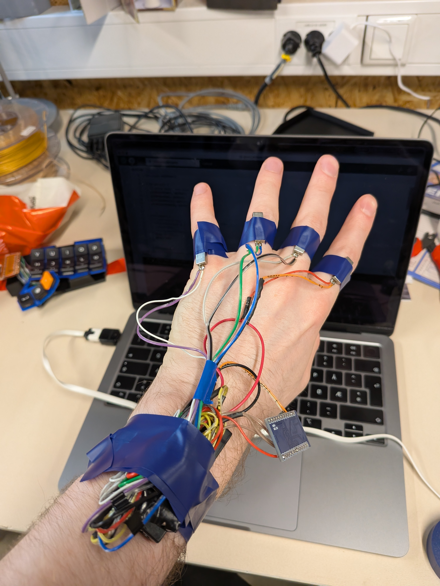
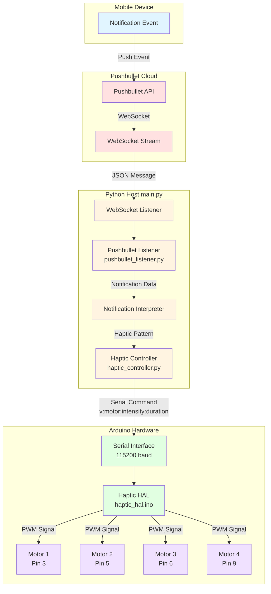

# SomaSens

A haptic feedback system that translates Pushbullet notifications into physical vibration patterns using Arduino-controlled motors.

## Hardware Photos



See the `pictures/` directory for additional photos of the hardware build.

## System Architecture



## How It Works

### 1. Notification Flow

When a notification arrives on your mobile device, it flows through the system as follows:

1. **Mobile Device** generates a notification event
2. **Pushbullet** captures the notification and sends it to the cloud
3. **WebSocket Stream** broadcasts the notification in real-time
4. **Python Host** receives and processes the notification

### 2. Python Processing Layer

The Python application consists of three main components:

#### main.py
- Entry point of the application
- Manages WebSocket connection lifecycle
- Coordinates between listener and controller
- Handles graceful shutdown

#### pushbullet_listener.py
- Connects to Pushbullet WebSocket stream
- Parses incoming JSON messages
- Interprets notifications and maps them to haptic patterns
- Currently defaults to `all_vibrate` pattern for all notifications

#### haptic_controller.py
- Manages serial communication with Arduino
- Provides haptic pattern primitives:
  - `left_to_right()` - Sequential vibration from left to right
  - `right_to_left()` - Sequential vibration from right to left
  - `all_vibrate()` - Simultaneous vibration of all motors
  - `confirm()` - Double-tap pattern
  - `cancel()` - Fading pulse pattern
- Sends formatted commands over serial to Arduino

### 3. Serial Protocol

Commands are sent from Python to Arduino over serial at 115200 baud:

```
v:motor_id:intensity:duration_ms
```

Example:
```
v:1:1.0:500  # Vibrate motor 1 at 100% intensity for 500ms
```

### 4. Arduino Hardware Layer

#### haptic_hal.ino
- Receives serial commands
- Parses vibration instructions
- Controls 4 motors via PWM pins (3, 5, 6, 9)
- Manages concurrent vibration events
- Automatically stops vibrations after specified duration

The Arduino tracks active vibration events for each motor and updates them in the main loop, allowing multiple motors to vibrate simultaneously with different durations.

## Hardware Setup

### Bill of Materials

For a complete list of components and purchase links, see [BOM.md](BOM.md).

Key components:
- Pro Micro ATmega32U4 (USB Type-C)
- 4x Linear vibration motors (0619AAC, 1.2V)
- 4x IRLZ44N MOSFETs
- 18650 battery holder
- Supporting components (resistors, diodes, wire)

### Pin Configuration
- Motor 1: Pin 3 (PWM)
- Motor 2: Pin 5 (PWM)
- Motor 3: Pin 6 (PWM)
- Motor 4: Pin 9 (PWM)

## Software Setup

### Prerequisites
- Python 3.x
- Arduino IDE
- Pushbullet account and API key

### Installation

1. Install Python dependencies:
```bash
pip install -r requirements.txt
```

2. Create a `.env` file with your Pushbullet API key:
```
pushbullet_api_key=YOUR_API_KEY_HERE
```

3. Upload `haptic_hal.ino` to your Arduino

4. Update the serial port in `haptic_controller.py` if needed (default: `/dev/cu.usbmodem101`)

### Running

```bash
python main.py
```

The system will:
1. Connect to the Arduino via serial
2. Establish WebSocket connection to Pushbullet
3. Listen for notifications
4. Trigger haptic patterns when notifications arrive

Press Ctrl+C to exit gracefully.

## Haptic Pattern Examples

### Left to Right Wave
```python
pattern = left_to_right(num_motors=4, intensity=1.0, duration=100, pause_duration=50)
```

### Confirmation Double-Tap
```python
pattern = confirm(motor=1, intensity=1.0, duration=100, gap=100)
```

### All Motors Simultaneous
```python
pattern = all_vibrate(num_motors=4, intensity=0.8, duration=200)
```

## Extending the System

### Adding New Patterns

Add pattern functions to `haptic_controller.py`:

```python
def custom_pattern(num_motors: int, intensity: float = 1.0):
    pattern = []
    # Define your pattern steps here
    pattern.append({"type": "vibrate", "motor": 1, "intensity": intensity, "duration": 100})
    pattern.append({"type": "pause", "duration": 50})
    return pattern
```

### Custom Notification Mapping

Modify `interpret_notification()` in `pushbullet_listener.py`:

```python
def interpret_notification(notification_type: str, title: str, body: str) -> list:
    if "urgent" in title.lower():
        return all_vibrate(4, intensity=1.0, duration=500)
    elif "message" in notification_type:
        return left_to_right(4, pause_duration=100)
    else:
        return confirm(1)
```

## Project Structure

```
somasens/
├── main.py                    # Application entry point
├── haptic_controller.py       # Serial communication & pattern library
├── pushbullet_listener.py     # WebSocket listener & notification handler
├── haptic_hal.ino            # Arduino firmware
├── requirements.txt          # Python dependencies
├── BOM.md                    # Bill of materials with component links
├── pictures/                 # Hardware iteration photos
├── stl/                      # 3D printable models
├── .env                      # API keys (not in version control)
├── .gitignore                # Git ignore rules
└── README.md                 # This file
```

## License

This project is open source and available for educational and personal use.
